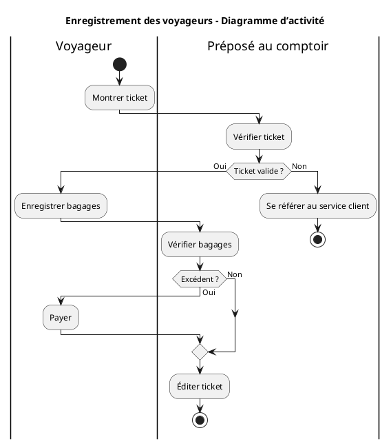
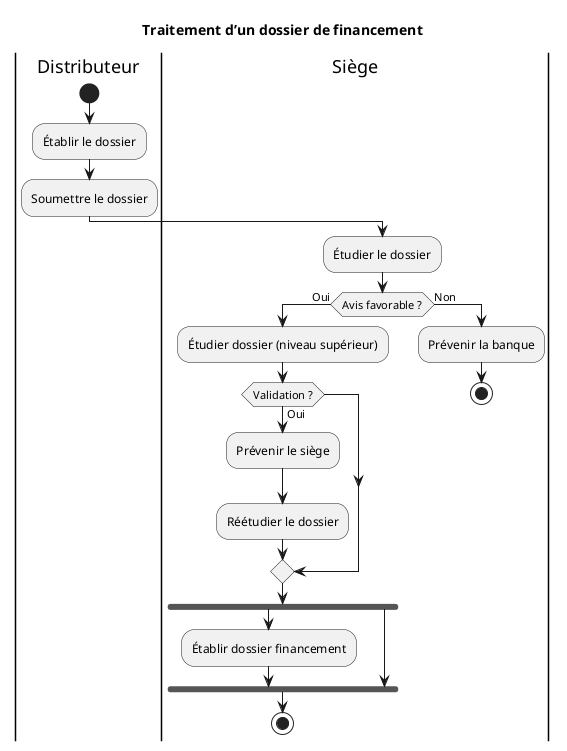

### Exercice 1

```plantuml
@startuml
title Enregistrement des voyageurs – Diagramme d’activité

|Voyageur|
start
:Montrer ticket;

|Préposé au comptoir|
:Vérifier ticket;

if (Ticket valide ?) then (Oui)

  |Voyageur|
  :Enregistrer bagages;

  |Préposé au comptoir|
  :Vérifier bagages;

  if (Excédent ?) then (Oui)
    |Voyageur|
    :Payer;
  else (Non)
    ' pas d’action
  endif

  |Préposé au comptoir|
  :Éditer ticket;
  stop

else (Non)
  |Préposé au comptoir|
  :Se référer au service client;
  stop
endif

@enduml
```

### Exercice 2

```plantuml
@startuml
title Traitement d’un dossier de financement

|Distributeur|
start
:Établir le dossier;
:Soumettre le dossier;

|Siège|
:Étudier le dossier;

if (Avis favorable ?) then (Oui)

  |Siège|
  :Étudier dossier (niveau supérieur);

  if (Validation ?) then (Oui)
    :Prévenir le siège;
    :Réétudier le dossier;
  endif

  fork
    :Établir dossier financement;
  fork again
    ' autre traitement parallèle si nécessaire
  end fork

  stop

else (Non)
  :Prévenir la banque;
  stop
endif

@enduml
```
